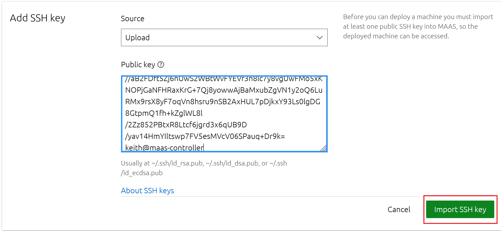
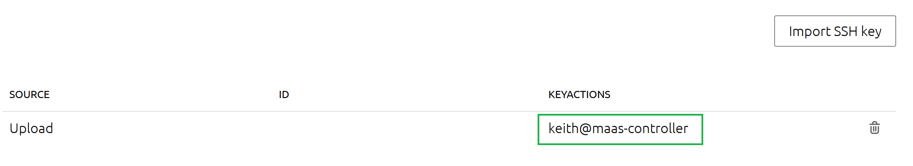

# Project-MAAS-Install-and-Configuration-Part2.md

The MAAS configuration continues; however, for the sake of saving time we're going to reference the MAAS docuemntation
and/or the HTTP User interface when completing steps or applying changes.

• Step 1: Import the SSH public key that was generated previously.

