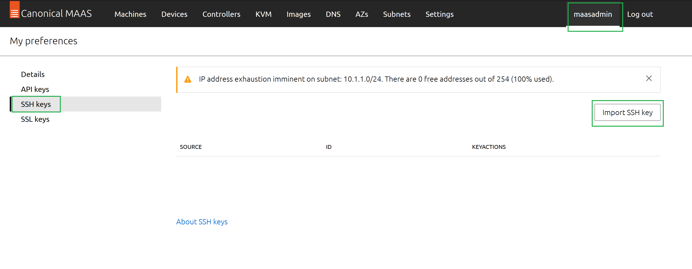
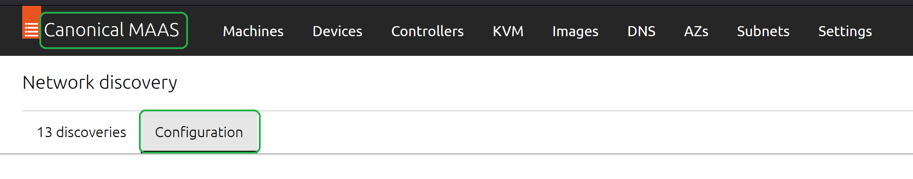
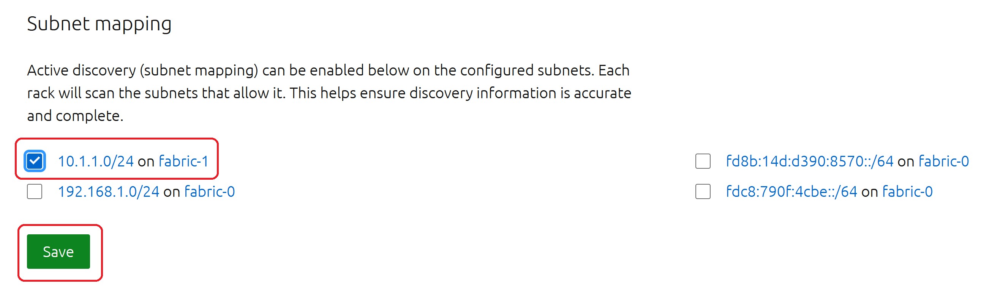
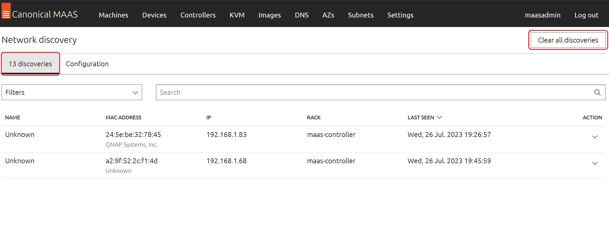

# Project-MAAS-Install-and-Configuration-Part2.md

The MAAS configuration continues; however, for the sake of saving time we're going to reference the MAAS docuemntation
and/or the HTTP User interface when completing steps or applying changes.

• Step 1: Import the SSH public key that was generated previously.

• Step 2: Set the Netwwork Discovery fabric to the <em>Host Only</em> VLAN (10.1.1.0/24)

• Step 3: Remove (delete) any previously discovered machines/devices on the public bridged VLAN (192.168.1.0/24)

